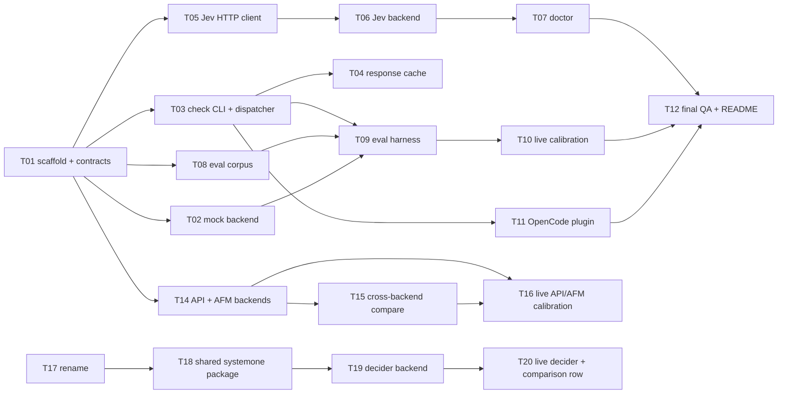

# Tiny Bouncer — Roadmap

Authority for behaviour: `doc/architecture.md` (specification and design decisions).
Measured results: `doc/findings.md`. This file holds the session protocol and the task
queue.

Status: **all queued work is complete** (T01–T20). The per-task specifications that used to
follow the queue were removed when the documentation was split by purpose; they remain in
git history (last present in the revision before this one) and each task's outcome is
recorded in its queue row and its commit. §5 lists candidates for future work.

---

## 1. Session protocol

The system is implemented by *task sessions*: independent work units, each executable by
a fresh agent (a subagent or a separate OpenCode session) that reads the docs, implements
one task until its acceptance criteria pass, then commits.

Rules for every session:

1. **Read first**: `doc/architecture.md` (behaviour authority), `doc/findings.md` (what has
   been measured) and `doc/plan.md` §4 (queue status). Do not rely on memory from other
   sessions.
2. **Claim**: pick the first task in §4 whose status is `pending` and whose dependencies
   are all `done`. Add or edit that task's row (status `in-progress`, session name, and a
   specification: goal, files, requirements, acceptance criteria) and commit:
   `Txx: claim (session <name>)`. Work only on your task's files plus your row in this
   file; leave other statuses untouched.
3. **Implement** exactly the task specification in your row. Reference architecture
   sections; do not invent behaviour that contradicts the architecture, and update neither
   the specification nor other tasks. If you find a genuine spec conflict, stop, note it in
   the task row, and leave status as `blocked` with an explanation.
4. **Verify**: run every acceptance-criterion command until all pass. `gofmt -l .` must
   be empty and `go vet ./...` clean for any Go-touching task.
5. **Finish**: set status `done`, record the outcome and the commit hash in the row, and
   commit everything as `Txx: <one-line summary>` (single commit unless the task says
   otherwise). Never commit a failing state. Do not push unless instructed.

Scheduling: record a task's parallel-safety in its row when it has peers whose file sets do
not overlap. When in doubt, run tasks strictly in queue order.
One task per session; a session must not start a second task.

**Documentation discipline.** A task that establishes a contract or a design decision
records it in `doc/architecture.md`; a task that measures behaviour records the numbers in
`doc/findings.md`. Neither belongs in a queue row beyond the summary needed to read the
row itself.

## 2. Toolchain

| Requirement | Notes |
|---|---|
| Go ≥ 1.23 | module `tinybouncer`, **stdlib only** (no `go get` in any task) |
| `make`, `git` | builds and commits |
| Node ≥ 20, TypeScript | the OpenCode plugin only (`opencode/plugins/tiny-bouncer/`) |
| `uv` ≥ 0.12 | Python tooling for the local decider backend; no Python enters the repository |
| Live backends | Jev needs an API key; `api` needs an LM Studio endpoint; `afm` needs macOS 27 + Apple Silicon; `decider` needs a locally served checkpoint. Reproduction commands: `doc/findings.md` §8. |

## 3. Dependency graph

Critical path: T01 → T03 → T09 → T10 → T12. The Jev chain (T05→T06→T07) and the plugin
(T11) were off the critical path and parallelisable as marked. The API/AFM chain
(T14→T15→T16) and the decider track (T18→T19→T20) are post-v0.1.0 comparison tracks: their
offline halves (T14, T15, T18, T19) are CI-safe, while T16 and T20 need live backends.

## 4. Task queue

| ID | Task | Depends on | Status | Commit |
|---|---|---|---|---|
| T01 | Scaffold Go module, core contracts, backend registry, Makefile | — | done | 1606c88 |
| T02 | Mock backend | T01 | done | 74eaca7 |
| T03 | `check` CLI + dispatcher | T01 | done | 07a9bdc |
| T04 | Response cache | T03 | done (T04-cache) | 5501776 |
| T05 | Jev HTTP client | T01 | done | eef222e |
| T06 | Jev backend (battery + mapping) | T05 | done (T06-jev-backend) | 08fbaa9 |
| T07 | `doctor` CLI | T06 | done (T07-doctor) | 8004449 |
| T08 | Eval corpus + validation | T01 | done (T08-corpus) | a41151a |
| T09 | Eval harness, metrics, reports, history | T03, T08, T02 | done (T09-eval) | ad7c498 |
| T10 | Live calibration + regression gates | T09, T07 | done (T10-calibration) | 070839a |
| T11 | OpenCode V2 plugin | T03 | done (T11-plugin) | 5f27388 |
| T12 | Final QA, README, end-to-end, tag | T07, T09, T10, T11, T13 | done (T12-final-qa) | 3880e4e |
| T13 | Battery: inline-code-execution hazard | T10 | done (T13-battery) | 3af162b |
| T14 | API backend (OpenAI-compatible) + AFM backend | T01 | done (T14-api-afm) | 287828b |
| T15 | Cross-backend comparison (`eval --against`) | T14 | done (T15-compare) | 850ff2f |
| T16 | Live API/AFM calibration + comparison facts | T14, T15 | done (T16-live) | f43eeba |
| T17 | Rename project to tiny-bouncer | T16 | done (T17-rename) | e44cf4b |
| T18 | Extract the System One judgment into a shared package | T17 | done (T18-systemone) | 0498f11 |
| T19 | `decider` backend (Strands Decider 2B) | T18 | done (T19-decider) | d72669d |
| T20 | Live decider calibration + comparison row | T19 | done (T20-live) | 312bffa |

Every row above carries its outcome in `doc/findings.md` (measurements) or
`doc/architecture.md` (contracts). Notable deviations recorded in the commits rather than
the rows: T16 wrote no per-backend gates files because both chat backends are
comparison-only, T17 renamed the project and the checkout directory, and T20 ran the
decider server through `server.create_app` because the released CLI has no `--strict-window`
option.

## 5. Future work (candidates, not commitments)

1. **Manual TUI smoke test.** The checklist in `README.md` ("Manual TUI verification
   checklist") has not been executed against a real OpenCode session; T12 recorded it as
   pending. Everything else in the release path is verified.
2. **Cascade / pre-filter stage.** `doc/architecture.md` §10 anticipates a local static
   analyser (prefix and argument rules) in front of Jev: microseconds per command, with the
   remainder escalated. Not built.
3. **The decider as a cascade stage.** Measured as a sole judge it is comparison-only
   (FPR 0.415), but it holds `FNR = 0` and runs locally; as a first stage that escalates
   everything it flags to Jev it would trade latency and privacy against cost, and needs its
   own evaluation.
4. **Wider model coverage.** The `api` backend has only ever been evaluated with
   Gemma-4-E2B; other local models are a configuration change plus a calibration run.
5. **A larger, less synthetic corpus.** Every threshold in the project is fitted to 265
   synthetic records, which bounds how far the operating points can be trusted.
6. **New System One backends.** T18 made the battery, route and mapping shared, so a
   further system-one model is a transport adapter plus its own sweep.
