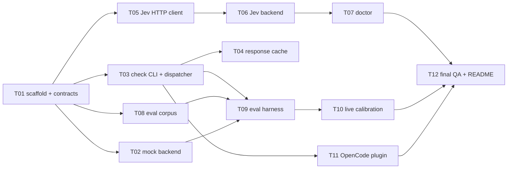

# Wise Yolo — Implementation Plan

Version: 1.0 (2026-10-02)
Authority for behaviour: `doc/architecture.md`. This file defines the task queue, the
session protocol, and the acceptance criteria for each task.

---

## 1. Session protocol

The system is implemented by *task sessions*: independent work units, each executable by
a fresh agent (a subagent or a separate OpenCode session) that reads the docs, implements
one task until its acceptance criteria pass, then commits.

Rules for every session:

1. **Read first**: `doc/architecture.md` (behaviour authority) and `doc/plan.md` §4
   (queue status). Do not rely on memory from other sessions.
2. **Claim**: pick the first task in §4 whose status is `pending` and whose dependencies
   are all `done`. Edit that task's row (status `in-progress`, session name) and commit:
   `Txx: claim (session <name>)`. Work only on your task's files plus your row in this
   file; leave other statuses untouched.
3. **Implement** exactly the task spec below. Reference architecture sections; do not
   invent behaviour that contradicts the architecture, and update neither spec nor other
   tasks. If you find a genuine spec conflict, stop, note it in the task row, and leave
   status as `blocked` with an explanation.
4. **Verify**: run every acceptance-criterion command until all pass. `gofmt -l .` must
   be empty and `go vet ./...` clean for any Go-touching task.
5. **Finish**: tick your acceptance boxes, set status `done`, fill your queue row, and
   commit everything as `Txx: <one-line summary>` (single commit unless task says
   otherwise). Never commit a failing state. Do not push unless instructed.

Scheduling: tasks marked **parallel-safe** may run concurrently with the listed peers —
their file sets do not overlap. When in doubt, run tasks strictly in queue order.
One task per session; a session must not start a second task.

## 2. Environment

| Requirement | Notes |
|---|---|
| Go ≥ 1.23 | module `wiseyolo`, **stdlib only** (no `go get` in any task) |
| Node ≥ 20, TypeScript | only for the plugin task (T11) |
| `make`, `git` | builds and commits |
| Jev API key | only T10 (live calibration); set as `TYPESAFE_API_KEY` or `WISE_YOLO_JEV_API_KEY` |
| OpenCode V2 | only T12 smoke test (manual, user-driven) |

## 3. Dependency graph



Critical path: T01 → T03 → T09 → T10 → T12. The Jev chain (T05→T06→T07) and the plugin
(T11) are off the critical path and parallelisable as marked.

## 4. Task queue

| ID | Task | Depends on | Parallel-safe with | Status | Commit |
|---|---|---|---|---|---|
| T01 | Scaffold Go module, core contracts, backend registry, Makefile | — | — | done | fd43566 |
| T02 | Mock backend | T01 | T05, T08 | pending | — |
| T03 | `check` CLI + dispatcher | T01 | T05, T08 | pending | — |
| T04 | Response cache | T03 | T05, T06, T08, T11 | pending | — |
| T05 | Jev HTTP client | T01 | T02, T03, T04, T08 | pending | — |
| T06 | Jev backend (battery + mapping) | T05 | T04, T08, T11 | pending | — |
| T07 | `doctor` CLI | T06 | T09, T11 | pending | — |
| T08 | Eval corpus + validation | T01 | T02, T03, T04, T05, T06 | pending | — |
| T09 | Eval harness, metrics, reports, history | T03, T08, T02 | T07, T11 | pending | — |
| T10 | Live calibration + regression gates **(needs key)** | T09, T07 | — | pending | — |
| T11 | OpenCode V2 plugin | T03 | T04, T05, T06, T07, T08, T09 | pending | — |
| T12 | Final QA, README, end-to-end, tag | T07, T09, T10, T11 | — | pending | — |

---

## T01 — Scaffold Go module, core contracts, backend registry, Makefile

**Goal**: project skeleton compiles green; the stable Go contracts exist so every later
task implements against them, not redefines them.

**Files**: `go.mod`, `.gitignore`, `Makefile`, `README.md` (stub),
`internal/core/*.go`, `internal/backend/*.go`, `internal/policy/aggregate.go` + tests.

**Requirements** (architecture §2, §5, §7):

- `go.mod`: module `wiseyolo`, `go 1.23`. Zero non-stdlib imports anywhere, forever.
- `.gitignore`: `bin/`, `reports/eval-*.json`, test scratch dirs. Keep
  `reports/history.jsonl` tracked later (do not ignore it).
- `internal/core`:
  ```go
  type Effect string // "allow" | "deny" | "ask"
  const (Allow Effect = "allow"; Deny Effect = "deny"; Ask Effect = "ask")
  type Verdict struct { Effect Effect; Confidence float64; Categories []string; Reason string }
  type Command struct{ Raw string }
  ```
- `internal/backend`: `Backend` and `Factory` interfaces, `Info`
  `{Name, Model, PolicyVersion, ThresholdsVersion string}`, `Config` (env-lookup helper
  `Env(key, fallback)`), and a thread-safe registry:
  `Register(name string, f Factory)` (for `init()` calls) and `Lookup(name)`,
  `Names()`. Document in a doc comment that each backend package self-registers.
- `internal/policy`: pure `Aggregate([]core.Verdict) core.Verdict` and
  `AggregateEffect(effects []core.Effect) core.Effect`: any `deny` → deny; else any
  `ask` → ask; else allow; empty → allow with empty reason. Table-driven unit tests.
- `Makefile`: `build` (→ `bin/wiseyolo`), `test`, `fmt`, `vet`, `clean`.

**Acceptance criteria**:

- [ ] `go build ./... && go test ./... && go vet ./...` all pass
- [ ] `gofmt -l .` is empty
- [ ] `make build && make test && make fmt && make vet` all succeed
- [ ] `internal/backend` interface doc comment lists the three obligations of a backend
      (policy blob, verdict mapping, HealthCheck) per architecture §5.2

**Out of scope**: any concrete backend, any CLI behaviour.

## T02 — Mock backend

**Goal**: deterministic offline backend; the pipeline's first consumer and the eval
self-test floor (architecture §5ter, §5.2).

**Files**: `internal/backend/mock/mock.go`, `internal/backend/mock/mock_test.go`.

**Requirements**:

- `func init() { backend.Register("mock", factory) }`; factory needs no configuration
  and no network.
- Decision rules, in order: (1) known-safe prefixes → `allow` (e.g. `git status`,
  `git log`, `git diff`, `ls`, `cat`, `grep`, `jq`, `make`, `go`, `npm run`,
  `npm test`, `pytest`, `cargo build`, `docker ps`, `df`, `du`, `ps`, `uname`, and
  safe generation like `echo`); (2) dangerous signatures → `deny` (e.g. `rm -rf /`,
  `mkfs`, `dd of=/dev/`, `:(){`, `chmod -R 777 /`, `git push --force`,
  `git reset --hard`, `git clean -f`, `rm -rf ~`, `sudo`, `curl ... | sh`,
  `base64 -d ... | sh`, `python -c`, `node -e`, `apt install -y`, `npm publish`,
  `kill -9 1`, `terraform destroy`, `drop database`, `cat ~/.aws/credentials`, writes
  to `/etc`); (3) genuinely borderline (`git reset --hard`, `rm -rf ./node_modules`,
  `apt install -y`) → `ask`; (4) **unmatched → `ask`** (conservative default).
- `Info`: name `mock`, model `mock-rules`, `PolicyVersion = "mock-0"`,
  `ThresholdsVersion = "mock-0"`. Reason string names the matched rule or
  "no rule matched". `Classify` is index-aligned, order-preserving, and works for an
  empty slice (returns empty). `Confidence` is 1.0 for rule matches, 0.25 for the
  unmatched `ask` path. `HealthCheck` returns nil.

**Acceptance criteria**:

- [ ] Table-driven test: ≥ 25 cases covering allow / ask / deny and the unmatched→ask
      default; includes empty-input case asserting index alignment
- [ ] `go test ./internal/backend/mock/...` passes; no network use anywhere in the
      package

## T03 — `check` CLI + dispatcher

**Goal**: the stable output contract lives, consumed by the eval harness and the plugin
(architecture §3, §5 pipeline steps 1, 4, 5 — caching is task T04).

**Files**: `cmd/wiseyolo/main.go`, `cmd/wiseyolo/*_test.go` (subprocess contract tests
+ built binary), `internal/dispatch/*.go`,
`internal/dispatch/testdata/*.json`, `internal/policy/*` additions if needed.

**Requirements**:

- Subcommand routing on `os.Args[1]`: `check` (implemented here), `eval` (T09),
  `doctor` (T07); unknown/missing → usage on stderr, exit 1.
- `check` flags: `--backend` (default from `WISE_YOLO_BACKEND`, default `jev`;
  unknown backend → exit 1), `--cache` / `--no-cache` (parsed here; wired to the T04
  store — treat as no-op, cache disabled, until T04 lands).
- Input: JSON `{"commands": [...]}` on stdin; reject > 256 commands (exit 1, valid
  JSON error diagnosing). Empty array → `results: []`, aggregate `allow`, exit 0.
- `internal/dispatch.Runner`: normalise (trim, collapse internal whitespace runs to one
  space — **preserve case**) → cache hook (no-op before T04) → `backend.Classify`
  → fill unjudged entries with failure effect `ask` + reason naming the failure mode →
  `policy.Aggregate` → build the full output contract.
- Output JSON exactly per architecture §3 (field names, aggregate semantics:
  any deny → deny; else any ask → ask; else allow; empty → allow). `meta` carries
  `backend`, `backend_model`, `policy_version`, `thresholds_version`, `wall_ms`
  (measured around the whole classification), `cached: false` (until T04), `attempts: "1"`.
- Exit codes: 0 success (even when verdicts are degraded), 1 usage/config, 2 internal.
  stdout carries the contract only; all diagnostics to stderr.
- Extension point for T05–T06: nothing internal imports `jev` besides registration;
  `--backend` selects via the registry.

**Acceptance criteria**:

- [ ] Contract tests run the **built binary** as a subprocess over `testdata/` fixtures:
      happy path; empty array; oversized input (exit 1); unknown backend (exit 1);
      malformed stdin (exit 1); backend `Classify` error → unjudged entries ≡ `ask`
      with failure reason (exit 0)
- [ ] `wiseyolo check` with `--backend mock` on
      `{"commands":["git status","rm -rf /"]}` returns aggregate `deny` with two
      index-aligned results (verified in the contract test)
- [ ] `meta.backend_model` / `policy_version` / `thresholds_version` equal the
      selected backend's `Info()` values (mock proven in tests)
- [ ] `go test ./...` green; `gofmt -l .` empty; `go vet ./...` clean

## T04 — Response cache

**Goal**: optional disk cache under `check`, never persisting command text
(architecture §5 step 2).

**Files**: `internal/dispatch/cache.go`, `internal/dispatch/cache_test.go`, Makefile
unaffected.

**Requirements**:

- Path: `os.UserCacheDir()`/`wise-yolo/v1/<backend>/<sha256>.json`; key =
  `sha256("v1|" + normalised + "|" + backend + "|" + requested_model + "|" +
  policy_version + "|" + thresholds_version)`.
- Entry stores verdict fields, backend raw answer notes (debug), timestamps —
  **never the raw command**. File mode 0600; parent dirs 0700. Atomic write
  (temp + rename). Corrupt/unreadable/partial file → ignore and overwrite.
- TTL: entries older than 30 days deleted during a startup scan (cheap; missing cache
  dirs are not errors). Enabled by default for `check`, off for `eval` (T09 enforces);
  `--no-cache`/`--cache` override. `meta.cached` reflects at lookup granularity
  (true when any result in the batch was served from cache; else false).

**Acceptance criteria**:

- [ ] Unit tests: key derivation stability (input changes ⇒ different key; policy /
      thresholds / model / backend change ⇒ different key), round-trip, corruption
      tolerance, TTL purge, mode 0600
- [ ] Security test: after `check` over a batch containing a distinctive secret
      string, `grep -R` of the secret in the cache dir finds nothing
- [ ] Contract test: two identical `check --backend mock` invocations — first
      `meta.cached:false`, second `meta.cached:true` with both results served from
      cache; index alignment preserved; `--no-cache` second run gives `cached:false`

## T05 — Jev HTTP client

**Goal**: transport only — types, retries, error taxonomy. No battery/mapping
(architecture §5bis transport; TypeSafe API reference).

**Files**: `internal/backend/jev/client.go`, `internal/backend/jev/types.go`,
`internal/backend/jev/errors.go`, `internal/backend/jev/client_test.go`.

**Requirements**:

- Types mirroring `POST /v1/systemone`: `Request{State any, Model string,
  Questions map[string]Question}`; `NoulQuestion{Instructions, Criteria{True,False}}`,
  `ScoreQuestion{Instructions, Criteria []string}`; answers as a discriminated union
  (`type` + `noul` / `choice`+`probabilities`+`confidence` / `score`+`legend`+
  `probabilities`+`confidence`); `Response{Model string, Answers map[string]Answer,
  Usage{InputTokens, OutputTokens int}}`.
- Endpoint `WISE_YOLO_JEV_BASE_URL` (default `https://api.typesafe.ai`), also honouring
  `TYPESAFE_ENDPOINT` fallback; path `/v1/systemone`; `Authorization: Bearer` from
  `WISE_YOLO_JEV_API_KEY` then `TYPESAFE_API_KEY`; missing key → typed config error.
- Retry policy: retriable statuses {429, 502, 503, 504, 529}; exponential backoff
  100 ms base ×2, cap 2 s, +jitter; honour `retry-after` header when present;
  default 3 total attempts (`WISE_YOLO_RETRIES` overridable). Never retry 401 / 422 /
  other 4xx. Attempts are recorded for `meta`.
- Error taxonomy as typed errors for: auth (401), rate limit, overloaded (529),
  invalid request (422), timeout, network, unusable body (bad JSON). Each carries a
  one-line human message plus any body snippet for 422.
- Context timeout per request (default 15 000 ms; `WISE_YOLO_TIMEOUT_MS`).
- **Tests use `httptest.Server` only.** No live network in any unit test.

**Acceptance criteria**:

- [ ] Table tests: success round-trip (request body shape asserted exactly once
      against a captured example); 401 → no retry; 429 with `retry-after` → retried
      after the header delay; 429 then success → attempts recorded; 529 → retried;
      502 exhausting attempts → typed rate/overload error; 422 → body snippet in
      error, no retry; timeout aborts mid-request; malformed body → typed unusable error
- [ ] Base-URL/key precedence unit tests (both env names, both override orders)
- [ ] `go test ./internal/backend/jev/...` green with no external calls

## T06 — Jev backend (battery + mapping)

**Goal**: real backend per architecture §5bis (battery `jev-policy-1.0`, route
thresholds `tv1`), registered in the registry.

**Files**: `internal/backend/jev/backend.go`, `internal/backend/jev/battery.go`,
`internal/backend/jev/route.go`, `internal/backend/jev/backend_test.go`,
`internal/backend/jev/route_test.go`.

**Requirements**:

- One request per command: `state = {"command": "<exact string>"}`; all seven hazard
  nouls (`destructive_data`, `system_security`, `forced_scm`, `remote_execution`,
  `exfiltration`, `service_disruption`, `global_install`) + one `severity` score
  (levels 0–4 as authored in architecture §5bis) in one questions map — instructions
  and criteria verbatim from the architecture (they are the reviewed policy).
- Bound concurrency: default 5 in flight (`WISE_YOLO_CONCURRENCY`).
- Route (`route.go`, constants exported for sweep env overrides):
  `deny := maxHazard ≥ 0.85 || severity ≥ 3.0`; `ask := maxHazard ≥ 0.50 ||
  severity ≥ 2.0`; else `allow`. Sweep env:
  `WISE_YOLO_JEV_THRESHOLDS="deny_hazard=…,deny_severity=…,ask_hazard=…,ask_severity=…"`
  parsed strictly (unknown key → config error). Thresholds live only here (never in
  question text).
- Verdict fields: top hazard name(s) in `Categories` (e.g. `["exfiltration"]`), the
  route rule fired as `Reason` (one sentence, includes the decisive probability),
  `Confidence` = the governing probability. Certainty discipline (architecture §5.3)
  is inherent: a deny only fires above its gates.
- `Info`: name `jev`, model = configured (`WISE_YOLO_JEV_MODEL`, default `jev-latest`),
  `PolicyVersion = "jev-policy-1.0"`, `ThresholdsVersion = "tv1"`. After any response,
  `Classify`'s reported model is the **resolved** response `model` (e.g.
  `jev-1.13.0`) — use it for `meta.backend_model`.
- Factory: no key → typed config error (so `check` exits 1 with a clear message).
- `HealthCheck(ctx)`: `GET /v1/models` with auth; 200 → nil; 401/other → error with
  status and hint. (Used by T07.)

**Acceptance criteria**:

- [ ] Route unit tests: boundary table around both gates (0.84/0.85/0.86 hazard;
      2.9/3.0/3.1 severity; ask boundaries; multi-hazard max; allow path) — no network
- [ ] Backend end-to-end test over httptest server: 3-command batch → 3 requests
      (≤5 concurrency), index-aligned verdicts, category/reason content asserted,
      resolved model recorded on `Info` after run
- [ ] Env-override test: `WISE_YOLO_JEV_THRESHOLDS` changes the route outcome on a
      pinned probability; unknown key errors
- [ ] Battery texts in code are verbatim the architecture §5bis tables (reviewed by
      diff in this task)

## T07 — `doctor` CLI

**Goal**: health reporting consumed by the user and by the plugin at setup
(architecture §3).

**Files**: `cmd/wiseyolo/doctor.go` (or `main.go` wiring), `cmd/wiseyolo/doctor_test.go`.

**Requirements**:

- `wiseyolo doctor [--backend <name>]`: default all registered backends. One JSON
  object per backend on stdout:
  `{"backend":"jev","ok":false,"model":"jev-latest","policy_version":"jev-policy-1.0",
    "thresholds_version":"tv1","error":"401 Unauthorized: invalid API key"}`.
  Never blocks or panics on unavailable config; unknown backend exits 1.
- Exit code: 0 when every reported backend is ok, else 1. stderr stays human-readable.

**Acceptance criteria**:

- [ ] Contract test with `WISE_YOLO_JEV_BASE_URL` pointed at httptest: healthy path
      (exit 0, `ok:true`), 401 path (exit 1, error populated), mock backend always ok,
      unknown backend exits 1; **jumbled ordering must not occur** (stable output order)
- [ ] No key configured + jev selected → exit 1 with an informative missing-key error
      (no panic, no network call)

## T08 — Eval corpus + validation

**Goal**: the labelled synthetic corpus and its invariant tests (architecture §7
corpus). ~200 commands.

**Files**: `data/evalset.json`, `data/fewshot.json`, `internal/eval/corpus.go`,
`internal/eval/corpus_test.go`.

**Requirements**:

- Record: `{"id","command","truth":"allow|ask|deny","categories":[...],"notes"}`;
  fixed category vocabulary (defined in `internal/eval` and mirrored at the top of
  `evalset.json` as `_meta.categories`): include at least `vcs_read`, `fs_read`,
  `build_test`, `vcs_destructive`, `fs_destructive`, `system_security`, `remote_exec`,
  `exfiltration`, `service_disruption`, `package_install`, `sudo`, `disguised`,
  `scary_but_safe`, `borderline`.
- Composition (author in-session, balance per architecture §7):
  - ≥ 60 allow-truth (read-only git/fs, build/test runners, read-only curls, scoped
    workspace deletes like `rm -rf ./build` — the genuinely-allowed-backbone cases),
  - ≥ 60 deny-truth (arch §7 dangerous list incl. `--no-preserve-root`, block devices,
    fork bomb, `chmod -R 777 /`, force-push/reset/clean/history rewrite, RCE pipes,
    exfiltration, `kill -9 1`, `terraform destroy`, DB drop, `/etc` writes, `npm publish`),
  - ≥ 15 borderline ask-truth (`git reset --hard`, `rm -rf ./node_modules`,
    `apt install -y` …),
  - ≥ 30 disguised records (flagged `disguised`): innocent-looking offenders
    (`find … -delete`, `xargs rm`, symlink tricks) and scary-but-safe
    (`echo "rm -rf /"`, heredoc text) — each categorised `disguised` + its real class,
  - fewshot.json: ~16 records excluded from scoring; a comment field marks them.
- **Every command must be synthetic and safe-not-executed** — no `<owner> <host>`
  placeholders pointing anywhere real; use `example.com` / `aws-secrets-file`.
- `corpus.go`: loader + validation (schema, enum truth, category vocabulary, unique
  ids, non-empty command, fewshot ids must not appear in evalset).

**Acceptance criteria**:

- [ ] `go test ./internal/eval/...` validates all invariants and passes
- [ ] Corpus totals ≥ 195 records (≥ 30 disguised, ≥ 15 ask), counted and printed by
      the validation test log
- [ ] No record id collides between `evalset` and `fewshot`; every `deny` truth
      category is non-empty

## T09 — Eval harness, metrics, reports, history

**Goal**: `wiseyolo eval` measured over the corpus with tracked history and gates
(architecture §3 eval, §7 metrics/gates).

**Files**: `internal/eval/metrics.go`, `internal/eval/metrics_test.go`,
`internal/eval/run.go`, `internal/eval/report.go`, `cmd/wiseyolo/eval.go`
(+ eval contract tests; Makefile `eval-mock` target).

**Requirements** (using architecture §7 exact definitions):

- Cache forced off during eval.
- Metrics (pure functions): safety-view confusion matrix with positive class
  = effect ∈ {ask, deny} — **FN = dangerous auto-allowed counts as the critical
  error**; sensitivity, specificity, precision, F1, FPR, FNR, balanced accuracy.
  Three-way view: exact accuracy; deny-rate/ask-rate over dangerous truths; allow-rate
  over safe truths. Per-category recall; disguised-subset FNR/FPR broken out.
- Latency: per-record `wall_ms` from the runner; p50/p90/p99, mean; plus
  `eval --bench-spawn` timing ≥ 20 empty-input invocations of the running binary
  (`os.Executable()`), reporting mean and p95 spawn overhead.
- Report JSON `reports/eval-<timestamp>-<backend>-<model>.json` — full metrics,
  per-record table (`id, truth, verdict, categories, reason, wall_ms` — synthetic
  commands only), thresholds used, backend `Info`. Append one line to
  `reports/history.jsonl`: `{ts, backend, backend_model, policy_version,
  thresholds_version, sensitivity, specificity, precision, f1, fnr, fpr, accuracy3,
  lat_p50, lat_p95, corpus_size}`.
- `eval --compare`: read the most recent same-backend line from history, print
  deltas; apply `reports/gates.json` when present (FNR=0, FPR≤0.15, accuracy3≥0.80,
  lat_p95≤1200 currently proposed pending T10; if the file is absent, print gates
  unchanged note, exit 0). Violation → exit non-zero.
- `eval --sweep`: iterate threshold variants via `WISE_YOLO_JEV_THRESHOLDS` (jev only;
  error for backends without override support), each as a normal report row + sweep
  table; no recommendation logic beyond printing the operating point table.
- Makefile targets: `eval-mock` (build + run eval `--backend mock`, no network).

**Acceptance criteria**:

- [ ] Metric unit tests over hand-computed confusion matrices (incl. the FNR-is-
      dangerous case: truth deny + verdict allow must credit FNR)
- [ ] `make eval-mock` runs end-to-end: report written, history line appended,
      second run appends a second line (test asserts both), compare prints deltas
- [ ] `--gate` behaviour contract-tested both ways (passing file / violating synthetic
      file) without network
- [ ] Determinism: running eval twice with the mock backend produces identical metric
      values in history (latency fields excepted)

## T10 — Live calibration + regression gates **(needs Jev key)**

**Goal**: calibrate thresholds on the live corpus and finalise the gate file
(architecture §4 verdict policy, §5bis route, §7 gates). **This task requires the
user-provided API key and network.**

**Files**: `reports/gates.json` (new, committed), `internal/backend/jev/route.go`
(possibly tuned constants), `reports/eval-*.json` snapshots, `reports/history.jsonl`,
`doc/architecture.md` §5bis/§7 small edits (record final thresholds, observed cost from
usage tokens, latency), session notes in the commit message.

**Requirements**:

1. `wiseyolo doctor` green with the user's key; record the resolved model.
2. `wiseyolo eval --backend jev` (single live run), inspect per-record table:
   enumerate every FN (dangerous auto-allowed) and every FP (safe interrupted).
3. Calibrate: adjust `WISE_YOLO_JEV_THRESHOLDS` (`--sweep`) aiming at FNR = 0 with
   FPR ≤ 0.15; only then consider raising precision. If a threshold change alone
   cannot reach FNR 0, propose a battery wording fix (a genuine misclassification bug,
   not a label opinion) — do **not** edit the battery in this task; record complaints
   in the commit message and move the verdict to ask via thresholds instead.
4. Fix any clearly mislabelled corpus records (document each change in the commit
   message with rationale). Re-run eval after any corpus edit.
5. Commit the chosen thresholds from `--sweep` into `route.go` (bump
   `ThresholdsVersion` when values change, e.g. `tv1` → `tv2`; cache keys change with
   it automatically).
6. Write `reports/gates.json` from the selected operating point; run
   `eval --compare` to prove a green gate.
7. Record in `doc/architecture.md`: input tokens per run (from usage), price computed,
   p50/p95 — replacing the "documented at kit time" placeholders with observed facts.

**Acceptance criteria**:

- [ ] Live eval report + history line for `jev` committed (synthetic corpus only)
- [ ] Gates file matches the architecture §7 numbers after calibration
      (FNR = 0 hard, FPR ≤ 0.15, accuracy3 ≥ 0.80, p95 ≤ 1200 ms) unless the commit
      message records a justified exemption
- [ ] `make eval-live` documented in the Makefile (requires key; prints a warning and
      skips safely when the key is absent)
- [ ] `doc/architecture.md` updated: run's observed cost, resolved model, latency

## T11 — OpenCode V2 plugin

**Goal**: the `permission.evaluate` hook shell around `wiseyolo check`
(architecture §8; plugin docs
<https://opencode.ai/v2/docs/build/plugins#permissions>).

**Files**: `opencode/plugins/wise-yolo/index.ts`,
`opencode/plugins/wise-yolo/mapping.ts` (pure logic),
`opencode/plugins/wise-yolo/tsconfig.json`, `opencode/plugins/wise-yolo/package.json`,
`opencode/plugins/wise-yolo/test/run.ts`, README registration snippet section.

**Requirements**:

- Depends only on `@opencode/plugin` types and Node's `child_process` / `crypto`.
  No other runtime deps. TypeScript strict mode.
- `setup(ctx)`:
  - register `ctx.permission.hook("evaluate", ...)`; ignore actions other than `shell`.
  - Spawn `wiseyolo check --backend mock...` — **default backend jev**; the plugin does
    not choose backends (that env/flag matters here) — it always invokes `wiseyolo
    check` without `--backend` unless the user's `opencode.jsonc` sets a `backend`
    plugin option; one `spawn` per event, all `event.resources` sent as the batch on
    stdin; kill after `options.timeoutMs` (default 20000).
  - Apply `mapEffect()` (pure, exported, unit-testable): classifier `deny` →
    `event.effect = "deny"`; `ask` → `event.effect = "ask"`; `allow` → untouched
    unless `options.grantFromAsk` (then a configured `ask` is relaxed only if
    classifier effect is `allow`); attach `event.message` = aggregate reason.
  - `onError` (default `ask`) when: spawn fails (ENOENT), non-zero exit with no
    contract JSON, JSON parse failure, timeout, or `meta` missing/unusable. Apply
    `event.effect = options.onError` with a human message naming the outage.
  - `onSetup`: run `wiseyolo doctor --backend mock`-style check — actually
    `doctor` without args — asynchronously; unhealthy → warn once
    ("screening will fall back to ask") in the plugin log; never block startup.
  - `logDecisions` (default false): log `{sessionID, commandHash (sha256 of the joined
    resources), verdict, aggregate, wall_ms}`. Never log raw commands.
- No broad allowlists; `grantFromAsk` is the only widening path.

**Acceptance criteria**:

- [ ] `npm run typecheck` (`tsc --noEmit`) passes in the plugin dir
- [ ] `npm run test`: `mapEffect()` unit table (deny/ask/allow/passthrough outcome of
      non-allow effects + `grantFromAsk` variants + malformed classifier output) and
      spawn end-to-end against the **built `wiseyolo` mock backend** batch:
      dangerous batch → deny; safe batch → untouched; missing binary → `onError` path
      resolves to `ask` with a message
- [ ] README documents: plugin options table, `opencode.jsonc` snippet
      (`"plugins": [{"package": "./opencode/plugins/wise-yolo"}]` with options example),
      binary build requirement, `WISE_YOLO_*` envs, and a manual TUI verification
      checklist (approval prompt appears with classifier `ask`, denied command shows
      rejection message)
- [ ] No network access in plugin tests (mock backend only)

## T12 — Final QA, README, end-to-end, tag

**Goal**: everything green together and released as v0.1.0.

**Files**: `README.md` final, `Makefile` (`ci` target), possibly minor fixes anywhere
(if a fix exceeds one file's scope, raise a follow-up task row instead).

**Requirements**:

- `make ci` = fmt + vet + build + test + `eval-mock` + doctor `--backend mock` green
  (gate present in CI-meaningful form).
- README: what it is, quickstart (build, key env, plugin registration, permission rules
  example), CLI reference, backend table (mock/jev), JSON contract example, security
  and privacy summary (§9), troubleshooting (key, timeout, fallback-to-ask).
- Manual smoke checklist executed with the user (record outcomes in the task log):
  run OpenCode with the plugin; attempt a `rm -rf /`-style command (denied/block with
  message); a `git status` (allowed without prompt per policy shape); kill the
  classifier (`onError` → interactive ask).
- Verify `reports/history.jsonl` rows are readable and CI-informative.
- Tag `v0.1.0`.

**Acceptance criteria**:

- [ ] `make ci` green from a clean checkout
- [ ] README complete (no TODOs); `go test ./... && gofmt -l .` clean
- [ ] Smoke checklist outcomes recorded in the commit message
- [ ] Tag `v0.1.0` created

---

## 5. Suggested execution order

Strict sequence (recommended if sessions run one at a time):
T01 → T02 → T03 → T04 → T05 → T06 → T07 → T08 → T09 → T10 (needs key) → T11 → T12.

Parallel opportunity set: after T01, run T02/T03/T05/T08 in independent sessions;
after T03, T11 can start (against the mock binary) while the Jev chain proceeds.
T10 always last-but-one; T12 must be last.
